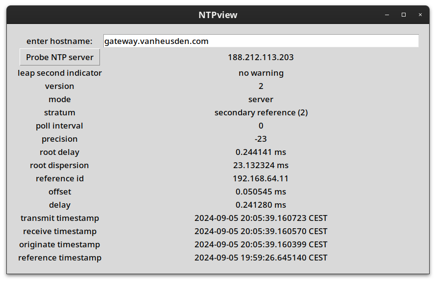

This is a simple NTP prober.
It shows everything there's to show in a GUI window.

Required packages:
* python3-ntplib
* python3-tk

Run the program by click on:
* nv.py
When installed as a debian package, it should be in the gnome menu.

Example:

released under MIT license in 2024 by folkert van heusden
